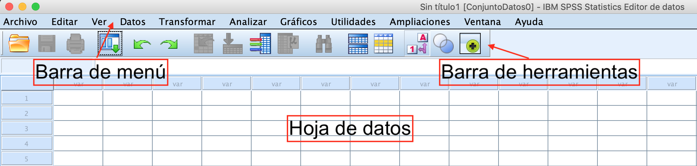

layout: true

<style>
.onehundredtwenty {
  font-size: 120%;
   }

<style>
.ninety {
  font-size: 90%;
   }

.eightyfive {
  font-size: 85%;
   }
   
.eighty {
  font-size: 80%;
   }
   
.seventyfive {
  font-size: 75%;
   }
   
.seventy {
  font-size: 70%;
   }
   
.fifty {
  font-size: 50%;
   }
   
.forty {
  font-size: 40%;
   }
</style>


```{r meta, echo=FALSE}
library(metathis)
meta() %>%
  meta_general(
    description = "Intro to R Programming",
    generator = "xaringan and remark.js"
  ) %>%
  meta_name("github-repo" = "favstats/xxx") %>%
  meta_social(
    title = "Intro a SPSS",
    url = "https://www.github.com/jrcarob/SPSS_Workshop",
    og_type = "website",
    og_author = "José R. Caro",
    twitter_card_type = "summary_large_image",
    twitter_creator = "@caroisallin"
  )
```

```{r setup, include=FALSE}
# dateWritten <- format(as.Date('2020-05-04'), format="%B %d %Y")
# workshop_day <- format(as.Date("2021-07-09"), format="%B %d %Y")
workshop_day <- "Workshop: Mayo 2024"
pacman::p_load(tidyverse, fontawesome, tidyverse, knitr)

options(
    htmltools.dir.version = FALSE,
    knitr.table.format = "html",
    knitr.kable.NA = ""
)
knitr::opts_chunk$set(
    warning = FALSE,
    message = FALSE,
    fig.path = "figs/",
    fig.width = 7.252,
    fig.height = 4,
    comment = "#>",
    fig.retina = 3 # Better figure resolution
)
# Enables the ability to show all slides in a tile overview by pressing "o"
xaringanExtra::use_tile_view()
xaringanExtra::use_panelset()
xaringanExtra::use_clipboard()
xaringanExtra::use_share_again()
xaringanExtra::style_share_again(share_buttons = "all")
xaringanExtra::use_extra_styles(
  hover_code_line = TRUE,
  mute_unhighlighted_code = FALSE
)
# xaringanExtra::use_webcam()


knitr::opts_chunk$set(warning = F, message = F) # Whether to display errors
```

---
name: title-slide
class: primary


#.fancy[`r rmarkdown::metadata$title`] 

###.fancy[`r rmarkdown::metadata$subtitle`]


<br>

`r workshop_day`

José R. Caro Barrera

[`r fa(name = "github", fill = "black")` @jcarob](https://github.com/jrcarob)<br>
[`r fa(name = "twitter", fill = "black")` @caroisallin](http://twitter.com/caroisallin)<br>

<!-- [`r fa(name = "link", fill = "black")` jrcarobarrera](https://www.jrcarobarrera.com) -->

.fifty[Enlace al material: [jrcarob.github.io/SPSS_Workshop](https://github.com/jrcarob/SPSS_Workshop)]

---


### ¡Es normal que SPSS cueste un poco al principio pero luego es más fácil!

```{r, echo = F, out.width="80%", fig.align = 'center'}

```


<!-- {width=50%} -->

.fifty[Ilustración adaptada de [Allison Horst](https://twitter.com/allison_horst)]

--

  + La experiencia es que SPSS no es fácil... ¡pero mejora!
  + Una gran cantidad de recursos en internet con casos de uso y ejemplos.


---

### Organización del Taller

#### Primera Parte: Fundamentos de SPSS

1. Primeros pasos en SPSS
  + La Barra de Menú
  + La Barra de Herramientas
  + La Hoja de Datos

2. Tipos de Variables

3. Ejemplo Práctico
  
$\text{B R E A K a las 18:00h}$

#### Segunda Parte: La Encuesta y el Tratamiento de los Datos.

---


class: inverse, middle, center

# PRIMERA PARTE

## Fundamentos y Primeros Pasos en SPSS

---

<!-- #### What is  ? -->


#### ¿Qué es .fancy[SPSS]?

SPSS (Statistical Package for Social Sciences) es un lenguaje de programación para .fancy[estadística], análisis de datos y ~~visualización~~.

* Amplia gama de herramientas y técnicas estadísticas que pueden utilizarse para analizar datos, explorar y comprender las relaciones entre variables.

* En proyectos de investigación y encuestas, permite analizar datos de encuestas y extraer datos de texto.

--

# Pero, ¿por qué aprender ?

<!--  -->


---

.leftcol60[

#### ¿Por qué aprender ?

<!--  -->


+ Fácil de usar: Interfaz de usuario intuitiva, no requiere esfuerzo ni conocimientos de programación.

+ Integral: estadísticas descriptivas y análisis de regresión, patrones de los datos que faltan y resumen de las distribuciones de las variables con una interfaz integrada.

+ Permite exportar datos en distintos formatos para utilizarlos en otros programas o simplemente para compartirlos y se puede integrar con programas de código abierto (como Python o R)

<!-- + Beautiful Data Visualization with `ggplot2` and more -->

]

.rightcol40[

<br>


.fifty[ [reticulate](https://github.com/easystats/easystats) integrates Python into R]


]

---


class: inverse, middle, center

# 1) Primeros pasos en SPSS

### La interfaz de usuario en SPSS


---

## Una Sesión en SPSS

Las sesiones en SPSS se pueden resumir en cuatro apartados:

 + Lectura de un conjunto de datos.
 
 + Selección del procedimiento.
 
 + Selección de las variables.
 
 + Comprobación de los resultados.


```{r, echo = F, out.width="120%", fig.align = 'center'}

```


---

### La Barra de Menú

La *barra de menú* aparece siempre y está formada por diez procedimientos:

```{r, echo = F, out.width="120%", fig.align = 'center'}

```

--

Si nos situamos en un procedimiento y hacemos click con el ratón, se despliega un menú con distintas opciones, algunas de las cuales acaban en una flecha  que indica la existencia de un sub-menú, el cual se muestra cuando situamos el puntero del ratón sobre cualquiera de dichas opciones:

```{r, echo = F, out.width="120%", fig.align = 'center'}

```


---

Principalmente, se suelen utilizar los siguientes procedimientos:

+ <span style="color: blue">.fancy[Archivo]</span>: realiza tareas generales con los archivos de datos como `Abrir`, `Importar Datos`, `Cerrar`, `Guardar`, `Imprimir`, `Salir`,...

Primer primer paso: Leer los datos: 2 maneras alternativas: la <span style="color: red">primera</span> es a través de la opción `Archivo` $\triangleright$ `Abrir`. Por defecto $\Rightarrow$ extensión `.sav`; además: Excel, csv, txt, SAS, Stata,..., y archivos generados por anteriores versiones. <span style="color: red">Segunda</span>: opción `Importar Datos`.

```{r, echo = F, out.width="80%", fig.align = 'center'}

```


---

+ <span style="color: blue">.fancy[Editar]</span>: hace las mismas funciones que los procedimientos del mismo nombre en cualquier otra aplicación del entorno _Windows_ como `Copiar`, `Cortar`, `Pegar`,...

+ <span style="color: blue">.fancy[Datos]</span>: permite realizar diferentes modificaciones al archivo de datos, ya sea `Añadir variables`, `Seleccionar casos` o `Ponderar casos`,...

+ <span style="color: blue">.fancy[Transformar]</span>: sirve, sobre todo, para transformar variables.

+ <span style="color: blue">.fancy[Analizar]</span>: con este menú, accederemos a las distintas herramientas estadísticas que nos ofrece SPSS.

+ <span style="color: blue">.fancy[Gráficos]</span>: permite obtener múltiples representaciones gráficas de los datos con los que trabajamos.

---

### La Barra de Herramientas

Consta de varios iconos que permiten acceder a las tareas más frecuentes:

```{r, echo = F, out.width="100%", fig.align = 'center'}

```

De especial interés es el icono  que permite consultar y repetir los últimos procedimientos realizados.

---

### La Hoja de Datos

La interfaz principal de SPSS está organizada en filas (observaciones) y columnas (variables).

```{r, echo = F, out.width="60%", fig.align = 'center'}

```

Aquí es donde se muestran los datos de un archivo abierto o de uno creado por nosotros, en este caso, introduciremos los datos de forma manual.

---

class: inverse, middle, center

# 2) Tipos de Variables

---

## Tipos de variables y su definición

La definición de variables se efectúa en la ventana correspondiente a `Vista de variables` en el Editor de Datos. En la parte de abajo de la pantalla, se pueden ver dos botones, según estén activada la vista de datos o vista de variables  

```{r, echo = F, out.width="75%", fig.align = 'center'}

```

+ <span style="color: blue">.fancy[Nombre]</span>: Para los nombres de las variables se aplican las siguientes normas:

  + Debe comenzar por una letra. Los demás caracteres pueden ser letras, dígitos, puntos o los símbolos `@`, `#`, `_`, `$`,...
  
  + Los nombres de variable no pueden terminar en punto.

---
  
  + Se deben evitar los nombres de variable que terminan con subrayado (para evitar conflictos con las variables creadas automáticamente por algunos procedimientos).
  
  + La longitud del nombre no debe exceder los ocho caracteres sin espacios en blanco ni caracteres especiales (por ejemplo, `!`, `?`, `'` y `*`).
  
  + Los nombres de las variables no distinguen mayúsculas de minúsculas. Así, los nombres <span style="color: red"> ALTURA</span>, <span style="color: blue"> Altura</span> y <span style="color: green"> AlTuRa</span> se consideran idénticos.

---

+ <span style="color: blue">.fancy[Tipo]</span>: Se pueden definir 8 tipos diferentes de variables:

```{r, echo = F, out.width="90%", fig.align = 'center'}

```

---

   + _**Numérica:**_ los valores son números. Se muestran en formato numérico estándar. <!-- El Editor de Datos acepta valores numéricos en formato estándar o en notación científica.-->

   + _**Coma:**_ los valores se muestran con comas que delimitan cada tres posiciones y con el punto como delimitador decimal.

   + _**Punto:**_ los valores se muestran con puntos que delimitan cada tres posiciones y con la coma como delimitador decimal.

   + _**Notación científica:**_ los valores se muestran con una $\text{E}$ intercalada y un exponente con signo que representa una potencia de base diez.

   + _**Fecha:**_ los valores se muestran en uno de los diferentes formatos de `fecha_calendario` y `hora_reloj`.

   + _**Moneda personalizada:**_ los valores se muestran en uno de los formatos de moneda personalizados que se hayan definido previamente. <!-- en la pestaña `Moneda` del cuadro de diálogo `Opciones`.-->

   + _**Cadena:**_ también son conocidas como variables alfanuméricas. Los valores no son numéricos y, por ello, no se utilizan en los cálculos.

---

+ <span style="color: blue">.fancy[Anchura]</span>: Determina el ancho de la columna.

+ <span style="color: blue">.fancy[Decimales]</span>: Fijan el número de decimales que aparecen en pantalla.

+ <span style="color: blue">.fancy[Etiqueta]</span>: Las variables pueden ser etiquetadas para que en los análisis posteriores aparezca dicha etiqueta.

+ <span style="color: blue">.fancy[Valores]</span>: Permiten introducir modalidades de las variables tipo cadena.

```{r, echo = F, out.width="60%", fig.align = 'center'}
knitr::include_graphics("images/09.png")
```
 
---

+ <span style="color: blue">.fancy[Valores perdidos]</span>: SPSS permite codificar estos valores de forma
discreta o en un rango determinado.

```{r, echo = F, out.width="50%", fig.align = 'center'}

```

+ <span style="color: blue">.fancy[Columnas]</span>: permiten introducir el ancho de la columna que también
puede cambiarse en la `Vista de Datos` pulsando y arrastrando los bordes de la columna.

+ <span style="color: blue">.fancy[Alineación]</span>: alinea los datos a la izquierda, derecha o centrado.


---

.leftcol20[

```{r, echo = F, out.width="75%", fig.align = 'center'}

```

```{r, echo = F, out.width="75%", fig.align = 'center'}

```

]

.rightcol80[

+ <span style="color: blue">.fancy[Medida]</span>: permite definir la variable como Ordinal o Nominal.

+ <span style="color: blue">.fancy[Rol]</span>: funciones que se pueden asignar a las variables para el análisis

   + _**Entrada:**_ la variable se utiliza como una entrada (p.e.: un predictor o variable independendiente).

   + _**Objetivo:**_ de salida o de destino (p. e.: variable dependiente).

   + _**Ambos:**_ se utiliza como entrada y salida.

   + _**Ninguna:**_ no tiene una asignación de funciones.

   + _**Partición:**_ para dividir datos en muestras separadas.

   + _**Dividir:**_ no se utilizan como variables de un archivo segmentado.

]


.rightcol20[


]

---

class: inverse, middle, center

# 3) Ejemplo Práctico

---

#### Ejemplo práctico: los siguientes datos proceden de un grupo de estudiantes:


| Nombre | Sexo | Edad | Estatura | Color Pelo | Fecha Nac. | Lugar |
| --- | --- | --- | --- | --- | --- | --- |
| Felipe | Hombre | 18 | 1,72 | Moreno | 11/23/2004 | Córdoba |
| Juan | Hombre | 20 | 1,81 | Rubio | 03/11/2002 | Sevilla |
| Carmen | Mujer | 17 | 1,70 | Moreno | 04/01/2005 | Jaén |
| Luisa | Mujer | 19 | 1,72 | Negro | 09/11/2003 | Córdoba |
| José | Hombre | 18 | 1,76 | Rubio | 13/08/2004 | Málaga |
| María | Mujer | 18 | 1,68 | Negro | 14/05/2004 | Granada |


+ Introducir los nombres y características de cada una de las variables en Vista de variables (las variables `sexo`, `colorPelo` y `LugarNac` tienen etiquetas de valor).

+ Introducir los datos de cada una de las variables en el Editor de datos SPSS.

+ Presentar las variables con sus respectivas Etiquetas de valor en el Editor de datos SPSS


---

class: inverse, middle, center

# $\text{Time for a B R E A K}$

---

class: inverse, middle, center

# SEGUNDA PARTE

## La Encuesta y el Tratamiento de los Datos

---

> Poblema al analizar una encuesta: *.red[codificación y depuración del original]*.


.leftcol[

+ _**Número de variables.**_

+ _**Datos perdidos.**_

+ _**Diferente escala.**_ 

+ _**Diferente codificación.**_

+ _**Creación de las variables.**_

+ _**Tipo de procedimiento a utilizar.**_

]

--

.rightcol[
```{r, echo = F, out.width="80%", fig.align = 'center'}

```
]

---

## Encuesta: Percepción de La Imagen de Córdoba 

+ Cuestionario: 20 preguntas.

+ **Población $\text{(N)}$ vs. Muestra $\text{(n)}$:** Necesario el cálculo del tamaño muestral.

+ Tipo de preguntas: 

    + Respuesta/elección múltiple.
    
    + Escala Likert.

+ La respuesta a cada pregunta es una variable.

---

## Encuesta: Percepción de La Imagen de Córdoba 

### Ejemplos:

**A) Respuesta concreta/múltiple**

_Pregunta 2: Respecto a la imagen de Córdoba como destino:_

    2.1. ¿Con qué tipo de emoción la asocia?
    
    2.2. ¿Con qué color la asocia?
    
    2.3. ¿Con qué sonido la asocia?
    
    2.4. ¿Con qué momento la asocia?
    
    2.5. Como paisaje sería...
    
    2.6. Como plato sería...
    
---

## Encuesta: Percepción de La Imagen de Córdoba 

**B) Respuesta escala Likert**

_Pregunta 3: Valore del 1 al 7 (siendo 1 "nada" y 7 "totalmente") su sentimiento general hacia Córdoba como marca de destino turístico._

| Item | 1 | 2 | 3 | 4 | 5 | 6 | 7 |
| -- | -- | -- | -- | -- | -- | -- | -- | 
| La personalidad de la marca de destino es <br> coherente con cómo me veo a mí mismo | | | | | | | | 
| La personalidad de la marca de destino es <br> un reflejo mí mismo | | | | | | | | 
| La personalidad de la marca de destino es <br> coherente con cómo me gustaría ser | | | | | | | | 
| La personalidad de la marca de destino es <br> un reflejo de la persona me gustaría ser | | | | | | | | |

---

## Encuesta: Percepción de La Imagen de Córdoba 

+ Dependiendo del tipo de pregunta, habrá que hacer un análisis diferente.

+ No obstante, como análisis preliminar inicial nos centraremos en una metodología puramente **descriptiva**

+ Pues las herramientas son comunes para todo tipo de preguntas: 

    + Contabilización del número (o porcentaje) de respuestas.
    
    + Análisis de respuestas más comunues.
    
    + Visualización gráfica solo si es necesaria o complementa el análisis tabular.


---

## Encuesta: Percepción de La Imagen de Córdoba 

+ Como primer paso habría que identificar la equivalencia entre el cuestionario y la BBDD.

```{r, echo = F, out.width="75%", fig.align = 'center'}

```

```{r, echo = F, out.width="75%", fig.align = 'center'}

```

---

## Encuesta: Percepción de la Imagen de Córdoba

+ A continuación, seleccionamos el tipo de herramienta de análisis que queremos emplear:

```{r, echo = F, out.width="75%", fig.align = 'center'}

```

---

## Encuesta: Percepción de la Imagen de Córdoba

+ Para un primer análisis descriptivo iremos paso a paso, seleccionando las variables de análisis:

```{r, echo = FALSE, out.width="45%", fig.align = 'center'}

```

<!--
```{r, echo = FALSE, out.width="45%", fig.show = 'hold', fig.align = 'center'}
knitr::include_graphics(c("images/23.png","images/24.png"))
```


<!--{width=50px} {width=50px}-->

Dejaremos activado el icono de `Mostrar tablas de frecuencias` y no calcularemos ningún estadístico adicional.

---

## Encuesta: Percepción de la Imagen de Córdba

+ Aparecerá una nueva ventana, la _Ventana de Resultados_, aquí es donde se muestran todos los resultados de los procedimientos de análisis que iremos utilizando en el _Editor de Datos_ de SPSS.

.leftcol[

```{r, echo = FALSE, out.width="80%", fig.align = 'center'}

```

]

.rightcol[

+ Estos resultados también se pueden guardar para tenerlos a mano y no tener que volver a realizar los análisis.

+ Los archivos de resultados de SPSS se guardan con la extensión `.spv`

]

---

class: inverse, middle, center

# ¿OS ATREVÉIS CON EL RESTO?

## ¡Gracias por vuestra atención!

```{r, echo = FALSE, out.width="60%", fig.align = 'center'}

```
